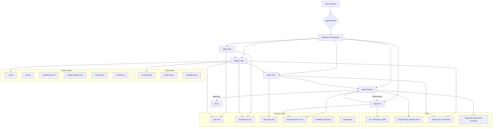

# AI Agents for Claude Code - Implementation Plan (v3)

**Target:** Go Backend Applications

---

## Overview

Define 5 specialized AI Agents operating within Claude Code, coordinated by a Workflow Orchestrator, for the Go backend development lifecycle.

---

## Overall Architecture



---

## Agent Router - 2-Layer Intent Detection

### Layer 1: LLM Intent Classifier

```
Input: user request
Output:
  intent = PLAN | CODE | TEST | FIX | REVIEW | FULL
  confidence = 0.0 - 1.0

Rules:
  confidence >= 0.8 --> route directly
  confidence < 0.8  --> ask user for clarification
```

### Layer 2: Rule Override

```
Force rules (override classifier):
  "plan" | "design" | "architecture"    --> PLAN
  "implement" | "code" | "build"        --> CODE
  "test" | "coverage"                   --> TEST
  "bug" | "error" | "fix" | "exception" --> FIX
  "review" | "check" | "audit"          --> REVIEW
  "/full"                               --> FULL (entire pipeline)
```

---

## Workflow Orchestrator

### State Machine

```
PLANNING --> CODING --> TESTING --> REVIEWING --> DONE
                                      |
                                      v (issues found)
                                    FIXING --> REVIEWING
                                                 |
                                                 v (max 3 loops)
                                               ESCALATE (notify user)
```

### State Persistence: `workflow-state.json`

```json
{
  "workflow_id": "auth-feature-001",
  "state": "TESTING",
  "loop_count": 1,
  "max_loops": 3,
  "created_at": "2026-03-06T10:00:00Z",
  "updated_at": "2026-03-06T10:30:00Z",
  "branch": "agent-wip-auth-feature",
  "artifacts": {
    "plan": ".ai-agents/plan.md",
    "architecture": ".ai-agents/architecture.md",
    "tests_plan": ".ai-agents/tests-plan.md",
    "reviews": [
      ".ai-agents/reviews/review-1.md"
    ]
  }
}
```

### Artifact Versioning

```
.ai-agents/
  |-- plan.md
  |-- architecture.md
  |-- tests-plan.md
  |-- workflow-state.json
  |-- reviews/
  |     |-- review-1.md
  |     |-- review-2.md
  |     +-- review-3.md
  |-- knowledge/
  |     |-- bugs-history.md
  |     +-- architecture-decisions.md
  +-- index/
        |-- symbols.json
        |-- imports.json
        +-- packages.json
```

### Agent Drift Prevention

Agent Code **must validate** `architecture.md` before generating code:

```
1. Read architecture.md
2. Identify allowed dependencies between layers
3. Generate code
4. Verify: code does NOT violate dependency rules
5. If violated --> self-correct before passing to Test
```

---

## Context Store

### Code Index (for LLM context optimization)

```
.ai-agents/index/
  |-- symbols.json    # functions, types, interfaces
  |-- imports.json    # import graph
  +-- packages.json   # package structure
```

Similar to Sourcegraph / tree-sitter index. Helps agents send only **relevant code** into the context window instead of the entire codebase.

**IMPORTANT:** Agents do NOT manually edit the JSON index files (prone to hallucination).
Update the index using tooling from the **target repository** (if available).
If no indexer exists, agents can use semantic/file search directly.

### Cost Control Strategy

```
Priority 1: Changed files
Priority 2: Direct imports (from imports.json)
Priority 3: Interface definitions (from symbols.json)
Priority 4: Related test files
DO NOT send: unrelated packages, vendor/, generated code

Advanced: AST dependency graph to precisely determine scope
```

### Knowledge Memory

```
.ai-agents/knowledge/
  |-- bugs-history.md           # Past bugs and their fixes
  +-- architecture-decisions.md  # ADR (Architecture Decision Records)
```

Agents learn from past experience:
- Fix bug --> write to bugs-history.md
- New design decision --> write to architecture-decisions.md

---

## Project Rules Engine

```
.rules/
  |-- go.md              # Go-specific conventions
  |-- architecture.md    # Layer rules, dependency direction
  |-- design-patterns.md # Design patterns guidelines
  |-- security.md        # Secure coding rules
  +-- testing.md         # Testing standards
```

### `.rules/go.md` - Go Backend Rules

```
# Go Project Layout
cmd/           -- Entry points
internal/      -- Private application code
  domain/      -- Entities, value objects, business rules
  service/     -- Use cases, application logic
  repository/  -- Data access interfaces & implementations
  handler/     -- HTTP/gRPC handlers
pkg/           -- Public shared libraries
api/           -- Proto files, OpenAPI specs
configs/       -- Configuration files

# Dependency Direction (STRICT)
  domain --> (nothing)
  service --> domain
  repository --> domain
  handler --> service
  FORBIDDEN: handler --> domain (direct)
  FORBIDDEN: domain --> repository
  FORBIDDEN: domain --> infra

# Error Handling
  REQUIRED: fmt.Errorf("%w", err) for wrapping
  REQUIRED: errors.Is() / errors.As() for checking
  FORBIDDEN: return errors.New(...) without context
  FORBIDDEN: silent error swallowing (_, err := ...; ignore err)

# Context Usage
  REQUIRED: func(ctx context.Context, ...) for all service/repository methods
  FORBIDDEN: service method without context.Context as first param

# Naming
  REQUIRED: CamelCase for exported, camelCase for unexported
  REQUIRED: interface names without "I" prefix (Reader not IReader)
  REQUIRED: error variables: ErrNotFound, ErrInvalid...

# Interfaces (Go Idiom: "Accept interfaces, return structs")
  REQUIRED: Interface defined at CONSUMER (service/ defines repo interface)
  REQUIRED: Producer (repository/) returns concrete struct
  REQUIRED: Small interfaces (1-3 methods), split if > 5 methods
  FORBIDDEN: Interface defined in domain/ then imported back (Java-style)
  FORBIDDEN: Interface with only 1 implementation and no need for mocking

# Concurrency
  REQUIRED: goroutine must have cancellation mechanism
  REQUIRED: channel must be closed by sender
  FORBIDDEN: goroutine without context or done channel
```

### `.rules/design-patterns.md` - Go Design Patterns

```
# =============================================================
# DESIGN PATTERNS FOR GO BACKEND
# Agent MUST read this file before designing and generating code.
# Choose the pattern that fits the problem. Do NOT force a pattern
# when it is not needed.
# =============================================================

# -----------------------------------------------
# CREATIONAL PATTERNS
# -----------------------------------------------

## Factory Method
  WHEN: Creating objects with many variants (payment processor, notifier, storage)
  GO IDIOM: Constructor function NewXxx() returning interface
  EXAMPLE:
    func NewStorage(storageType string) Storage {
        switch storageType {
        case "s3":  return &S3Storage{}
        case "gcs": return &GCSStorage{}
        }
    }
  NOTE: Prefer Functional Options over complex Factory

## Builder
  WHEN: Object with many optional configs (query builder, request builder)
  GO IDIOM: Functional Options pattern (RECOMMENDED for Go)
  EXAMPLE:
    type Option func(*Server)
    func WithPort(p int) Option { return func(s *Server) { s.port = p } }
    func WithTimeout(t time.Duration) Option { return func(s *Server) { s.timeout = t } }
    func NewServer(opts ...Option) *Server { ... }
  NOTE: Functional Options is the Go-idiomatic Builder

## Singleton
  WHEN: DB connection pool, logger, config (ONLY use when truly needed)
  GO IDIOM: sync.Once
  EXAMPLE:
    var (
        instance *DB
        once     sync.Once
    )
    func GetDB() *DB {
        once.Do(func() { instance = &DB{...} })
        return instance
    }
  WARNING: Avoid overuse. Prefer Dependency Injection.

# -----------------------------------------------
# STRUCTURAL PATTERNS
# -----------------------------------------------

## Repository Pattern (MANDATORY for data access)
  WHEN: Every entity needs data access
  GO IDIOM: "Accept interfaces, return structs" (Consumer-side interfaces)
  EXAMPLE:
    // service/user_service.go (CONSUMER defines interface)
    type UserRepository interface {
        FindByID(ctx context.Context, id string) (*domain.User, error)
        Save(ctx context.Context, user *domain.User) error
    }
    type UserService struct { repo UserRepository }

    // repository/user_postgres.go (PRODUCER returns struct)
    type PostgresUserRepo struct { db *sql.DB }
    func NewPostgresUserRepo(db *sql.DB) *PostgresUserRepo { ... }
    func (r *PostgresUserRepo) FindByID(ctx context.Context, id string) (*domain.User, error) { ... }
  MANDATORY: Interface defined at CONSUMER (service/), NOT in domain/
  NOTE: Keep interface small (1-3 methods). If interface > 5 methods --> split

## Adapter
  WHEN: Wrapping external service/library (payment gateway, email provider)
  GO IDIOM: Interface + wrapper struct
  EXAMPLE:
    type EmailSender interface { Send(ctx context.Context, to, body string) error }
    type sendgridAdapter struct { client *sendgrid.Client }
    func (a *sendgridAdapter) Send(ctx context.Context, to, body string) error { ... }
  DEFAULT USE, EXCEPT WHEN:
    - Library already has a good interface (e.g., AWS SDK v2 already has interfaces)
    - Only 1 implementation and no need for mocking in tests
    - Wrapper just forwards methods 1:1 without adding any logic

## Decorator / Middleware
  WHEN: Adding behavior without modifying original code (logging, auth, metrics, rate limit)
  GO IDIOM: HTTP middleware chain, function wrapping
  EXAMPLE:
    func LoggingMiddleware(next http.Handler) http.Handler {
        return http.HandlerFunc(func(w http.ResponseWriter, r *http.Request) {
            log.Printf("%s %s", r.Method, r.URL.Path)
            next.ServeHTTP(w, r)
        })
    }
    // Wrapping service:
    func WithLogging(svc UserService, logger Logger) UserService {
        return &loggingUserService{next: svc, logger: logger}
    }

## Facade
  WHEN: Aggregating multiple services into 1 entry point (order flow = inventory + payment + shipping)
  GO IDIOM: Struct aggregating dependencies
  EXAMPLE:
    type OrderFacade struct {
        inventory InventoryService
        payment   PaymentService
        shipping  ShippingService
    }
    func (f *OrderFacade) PlaceOrder(ctx context.Context, order Order) error { ... }

# -----------------------------------------------
# BEHAVIORAL PATTERNS
# -----------------------------------------------

## Strategy
  WHEN: Changing algorithm at runtime (pricing, sorting, compression)
  GO IDIOM: Interface + dependency injection
  EXAMPLE:
    type PricingStrategy interface {
        Calculate(ctx context.Context, order Order) (Money, error)
    }
    type standardPricing struct{}
    type premiumPricing struct{}
    // Inject strategy into service
    type OrderService struct { pricing PricingStrategy }

## Observer / Event-Driven (RECOMMENDED for decoupling)
  WHEN: One action triggers many side effects (user created -> send email + create audit log)
  GO IDIOM: Channel-based or Event Bus
  EXAMPLE:
    type Event struct { Type string; Payload interface{} }
    type EventBus struct {
        subscribers map[string][]func(Event)
        mu          sync.RWMutex
    }
    func (eb *EventBus) Publish(e Event) { ... }
    func (eb *EventBus) Subscribe(eventType string, handler func(Event)) { ... }
  NOTE: For microservices, use message broker (NATS, Kafka, RabbitMQ)

## Chain of Responsibility
  WHEN: Request passes through multiple processing steps (validation chain, approval workflow)
  GO IDIOM: Middleware pattern or linked handlers
  EXAMPLE: HTTP middleware chain (described under Decorator)

## Circuit Breaker (MANDATORY for external calls)
  WHEN: Calling external services (API, DB, message queue)
  GO IDIOM: Library gobreaker or custom implementation
  EXAMPLE:
    cb := gobreaker.NewCircuitBreaker(gobreaker.Settings{
        Name:        "payment-api",
        MaxRequests: 3,
        Timeout:     10 * time.Second,
    })
    result, err := cb.Execute(func() (interface{}, error) {
        return paymentClient.Charge(ctx, amount)
    })
  MANDATORY: Every external HTTP/gRPC call MUST have a circuit breaker

# -----------------------------------------------
# CONCURRENCY PATTERNS (GO-SPECIFIC)
# -----------------------------------------------

## Worker Pool
  WHEN: Processing many tasks concurrently with limits (batch processing, file upload)
  GO IDIOM: Buffered channel + goroutines
  EXAMPLE:
    jobs := make(chan Job, 100)
    for i := 0; i < numWorkers; i++ {
        go func() {
            for job := range jobs {
                process(job)
            }
        }()
    }
  MANDATORY: Must have done channel or context for cancellation

## Fan-Out / Fan-In
  WHEN: Splitting tasks across multiple goroutines then collecting results (parallel API calls)
  GO IDIOM: errgroup.Group
  EXAMPLE:
    g, ctx := errgroup.WithContext(ctx)
    for _, url := range urls {
        url := url
        g.Go(func() error { return fetch(ctx, url) })
    }
    if err := g.Wait(); err != nil { ... }

## Pipeline
  WHEN: Data flows through multiple processing steps (ETL, data transformation)
  GO IDIOM: Channel chaining
  EXAMPLE:
    func generate(ctx context.Context) <-chan int { ... }
    func transform(ctx context.Context, in <-chan int) <-chan string { ... }
    func sink(ctx context.Context, in <-chan string) { ... }

# -----------------------------------------------
# DEPENDENCY INJECTION (MANDATORY)
# -----------------------------------------------

## Constructor Injection
  GO IDIOM: NewXxx(deps...) pattern
  EXAMPLE:
    func NewUserService(repo UserRepository, logger Logger) *UserService {
        return &UserService{repo: repo, logger: logger}
    }
  MANDATORY: Every dependency injected via constructor, NO globals
  OPTIONAL: wire (Google) or fx (Uber) for DI container

# -----------------------------------------------
# PATTERN SELECTION GUIDE
# -----------------------------------------------

# Situation                               --> Pattern
# Creating objects with many variants     --> Factory Method
# Complex config with many options        --> Functional Options (Builder)
# Data access for an entity               --> Repository (MANDATORY)
# Wrapping external service               --> Adapter (DEFAULT, unless over-engineering)
# Adding logging/metrics/auth             --> Decorator / Middleware
# Calling external API/service            --> Circuit Breaker (MANDATORY)
# Changing algorithm at runtime           --> Strategy
# Action triggers many side effects       --> Observer / Event Bus
# Batch/parallel processing with limits   --> Worker Pool
# Parallel calls collecting results       --> Fan-Out / Fan-In (errgroup)
# Injecting dependencies                  --> Constructor Injection (MANDATORY)

# -----------------------------------------------
# ANTI-PATTERNS (DO NOT DO)
# -----------------------------------------------

# DO NOT: God struct (struct doing too many things)
# DO NOT: Circular dependencies between packages
# DO NOT: Global mutable state (use DI instead)
# DO NOT: Interface pollution (only create interface when >= 2 implementations or need mocking)
# DO NOT: Premature abstraction (don't create pattern for only 1 use case)
# DO NOT: Deep inheritance (Go has no inheritance, use composition)
```

---

## 1. Agent Create Plan

**Goal:** Analyze requirements, design Go backend architecture, and create a detailed implementation plan.

### Input
- User requirement description
- Existing codebase (if any)
- `.rules/*`

### Output
- `plan.md` -- Implementation plan
- `architecture.md` -- Architecture diagram (Mermaid)
- `tests-plan.md` -- Test cases with coverage target

### Workflow

```
1. Gather & analyze requirements
   |-- Ask clarifying questions if requirements are ambiguous
   |-- Identify scope, constraints, dependencies
   +-- List acceptance criteria

2. Design Go architecture
   |-- Draw system diagram (Mermaid: flowchart, sequence, class diagram)
   |-- Generate Go project layout:
  |     cmd/<entrypoint>/
   |     internal/domain/
   |     internal/service/
   |     internal/repository/
   |     internal/handler/
   |     pkg/
   |-- Define interfaces between layers
   |-- Define data flow & API contracts (protobuf/OpenAPI)
   +-- Choose appropriate design patterns (read .rules/design-patterns.md):
         - Identify which patterns are needed for each module
         - Document reason for choosing each pattern (don't force when not needed)
         - Define interfaces for Repository, Adapter, Strategy...
         - Define middleware chain (auth, logging, metrics, rate limit)
         - Identify Circuit Breaker for external calls

3. Create implementation plan
   |-- Break down into prioritized tasks
   |-- Identify files to create/modify (per Go layout)
   |-- Define interfaces between modules
   +-- Estimate complexity of each task

4. Design test plan
   |-- List test cases for each module
   |-- Identify edge cases & error scenarios
   |-- Define test data & required mocks
   +-- Set coverage target (minimum 80%)
```

### `plan.md` File Structure

```markdown
# Feature: [Name]
## Requirements
## Architecture (Mermaid diagrams)
## Go Project Layout (file tree)
## Task List (ordered)
## Files to Create/Modify
## Interface & API Contracts (protobuf/OpenAPI)
## Design Patterns (which pattern, why, in which module)
## Test Plan (with coverage target)
## Security Considerations
## Risks & Mitigations
```

---

## 2. Agent Create Code

**Goal:** Generate high-quality Go code adhering to SOLID, Clean Architecture, and Go best practices.

### Input
- `plan.md` + `architecture.md` from Agent Plan (if available)
- `.rules/*` (mandatory)
- `.ai-agents/index/` (code index)
- Existing codebase

### Output
- Go source code adhering to SOLID & Clean Architecture
- Updated plan.md with completion status

### Architecture Validation (preventing agent drift)

```
BEFORE GENERATING CODE:
  1. Read architecture.md
  2. Load .rules/go.md
  3. Identify dependency direction for each file
  4. Generate code
  5. Verify: no layer rule violations
  6. If violated --> self-correct
```

### Go Code Principles

```
SOLID Principles
|-- S -- Single Responsibility: Each struct/function has one responsibility
|-- O -- Open/Closed: Extend via interfaces
|-- L -- Liskov Substitution: Interface satisfaction
|-- I -- Interface Segregation: Small interfaces (io.Reader, io.Writer)
+-- D -- Dependency Inversion: Depend on interfaces, not structs

Clean Architecture Layers (Go)
|-- domain/      -- Entities, value objects, business rules (no imports from other layers)
|-- service/     -- Use cases, orchestration (imports domain only)
|-- repository/  -- Data access (imports domain for types)
|-- handler/     -- HTTP/gRPC handlers (imports service)
+-- infra/       -- DB connections, external clients, configs
```

### Design Patterns Compliance (read .rules/design-patterns.md)

```
APPLY BY DEFAULT (skip if over-engineering):
  - [ ] Repository Pattern for every entity data access (interface at consumer)
  - [ ] Adapter Pattern for external services (UNLESS library already has good interface)
  - [ ] Circuit Breaker for external HTTP/gRPC calls
  - [ ] Constructor Injection for every dependency (NO globals)
  - [ ] Middleware/Decorator for cross-cutting concerns (auth, logging, metrics)
  PRINCIPLE: Go favors simplicity. If a pattern only adds a wrapper without adding value --> skip

APPLY WHEN APPROPRIATE (per plan.md):
  - [ ] Functional Options when struct has many optional configs
  - [ ] Factory Method when creating objects with many variants
  - [ ] Strategy when algorithm changes at runtime
  - [ ] Observer/Event Bus when action triggers many side effects
  - [ ] Worker Pool / Fan-Out when parallel processing with limits is needed
  - [ ] Facade when aggregating multiple services into one flow

CHECK ANTI-PATTERNS:
  - [ ] No God struct
  - [ ] No circular dependencies
  - [ ] No global mutable state
  - [ ] No interface pollution (interface only when >= 2 impls or need mocking)
  - [ ] No premature abstraction
```

### Secure Coding Validation (mandatory)

```
Go-specific security checklist:
  - [ ] Input validation at every handler
  - [ ] Parameterized queries (NO string concat SQL, even with GORM raw)
  - [ ] Secure JWT: algorithm validation, expiry check, key rotation
  - [ ] NO hardcoded secrets (use env / vault)
  - [ ] Use crypto/rand instead of math/rand for security
  - [ ] json.Decoder with limit (prevent JSON injection / DoS)
  - [ ] Context timeout for every external call
  - [ ] Goroutine with cancellation mechanism (prevent goroutine leak)
  - [ ] Proper CORS configuration
  - [ ] TLS for every external connection
```

### Workflow

```
1. Read .rules/* and plan.md
   |-- Parse task list
   |-- Understand designed architecture
   |-- Validate dependency direction
   +-- Understand interface contracts

2. Analyze codebase (using Code Index)
   |-- Read symbols.json, imports.json
   |-- Identify current conventions
   |-- Find existing patterns & interfaces
  +-- Check dependency manifests (for example go.mod) if present

3. Generate code task by task
   |-- Create files per Go project layout
   |-- Apply SOLID principles
   |-- Adhere to layer separation (.rules/go.md)
   |-- Apply design patterns per plan.md (.rules/design-patterns.md):
   |     - Repository interface at consumer (service/), impl in repository/
   |     - Adapter for external services (unless library has good interface)
   |     - Circuit Breaker for external calls
   |     - Middleware chain for HTTP handlers
   |     - Functional Options for config structs
   |-- Apply secure coding rules
   |-- Every service method has context.Context
   |-- Error wrapping with fmt.Errorf("%w")
   +-- Ensure backward compatibility

4. Quality check
  |-- Run project build/validation commands
  |-- Run project lint/static checks
   |-- Cross-check with architecture.md (prevent drift)
   +-- Run secure coding checklist
```

### Pre-completion Checklist

- [ ] Code adheres to SOLID
- [ ] Design patterns used per plan (Repository, Adapter, Circuit Breaker...)
- [ ] No anti-patterns (God struct, circular deps, global state, interface pollution)
- [ ] Proper layer separation (.rules/go.md)
- [ ] Correct dependency direction (domain does not import infra)
- [ ] Every service method has context.Context
- [ ] Error handling: fmt.Errorf("%w"), errors.Is/As
- [ ] Goroutine with cancellation
- [ ] No breaking backward compatibility
- [ ] Go naming conventions (CamelCase, no I-prefix)
- [ ] Secure coding checklist passed
- [ ] Project validation commands passed

---

## 3. Agent Test Generator

**Goal:** Generate comprehensive Go test suite with table-driven tests and coverage targets.

### Input
- Source code from Agent Code
- `tests-plan.md`
- `.rules/testing.md`

### Output
- Unit tests (table-driven)
- Integration tests (testcontainers if needed)
- Coverage report

### Go Testing Standards

```
1. Table-driven tests (mandatory)
   tests := []struct {
       name    string
       input   InputType
       want    OutputType
       wantErr bool
   }{...}
   for _, tt := range tests {
       t.Run(tt.name, func(t *testing.T) { ... })
   }

   MANDATORY: Every test case MUST have assert/require (testify):
     - assert returned value (DO NOT just call function and ignore result)
     - assert error (wantErr true --> require.Error, false --> require.NoError)
     - assert state changes (if there are side effects)
     FORBIDDEN: Test that only calls a function without any assertion (coverage trap)

2. Mocking
   |-- gomock for interfaces
   |-- testify/mock when flexibility is needed
   +-- Every dependency injected via interface

3. Integration tests
   |-- Build tag: //go:build integration
   |-- testcontainers-go for DB/Redis/Kafka
   +-- Separated from unit tests

4. Test file placement
   |-- Unit: internal/service/user_service_test.go
   +-- Integration: tests/integration/user_test.go
```

### Coverage Policy

```
Minimum coverage: 80% (entire project)
  |-- domain/:     90%
  |-- service/:    85%
  |-- handler/:    80%
  |-- repository/: 70% (external dependencies)
  +-- Critical paths (auth, payment): 95%
```

### Workflow

```
1. Read tests-plan.md and source code
   |-- Understand modules to test
   +-- Identify interfaces to mock

2. Generate tests
   |-- Table-driven tests for each function
   |-- Generate mocks (gomock/testify)
   |-- Edge cases: nil, empty, boundary, overflow, context cancel
   +-- Error scenario tests

3. Run and verify
   |-- go test ./... -cover
   |-- Check coverage >= target
   |-- go test -race (detect race conditions)
   |-- If coverage not met --> generate more tests
   +-- Report results

4. Integration tests (if needed)
   |-- Setup testcontainers
   |-- Test with real DB/Redis
   +-- go test -tags=integration ./tests/...
```

---

## 4. Agent Fix Bug

**Goal:** Analyze, identify root cause, and fix Go backend bugs.

### Input
- Error description (error message, stack trace, steps to reproduce)
- Existing codebase

### Output
- Code fix
- Regression test (table-driven)
- Root cause report
- Update knowledge/bugs-history.md

### Workflow

```
1. Analyze the error
   |-- Parse error message / stack trace
   |-- Identify relevant file & line
   |-- Gather context surrounding the error
   |-- git blame -- see who/when changed
   |-- git log -p -n 10 -- recent changes to the relevant file
   +-- git diff -- compare with version before the bug appeared

2. Identify root cause
   |-- Trace code flow from the error point
   |-- Check input/output at each step
   |-- Go-specific checks:
   |     - goroutine leak?
   |     - nil pointer (interface nil vs typed nil)?
   |     - context cancelled/timeout?
   |     - race condition?
   |     - error swallowed?
   +-- Distinguish symptom vs root cause

3. Assess impact
   |-- List affected modules/functions
   |-- Check for similar bugs elsewhere
   +-- Identify minimum change scope

4. Apply fix
   |-- Fix code with the smallest possible change
   |-- Write regression test (table-driven)
  |-- Run repository test command set (including race checks if available)
  |-- Run repository lint/static validation
   +-- Verify fix does not break existing features

5. Report & save knowledge
   |-- Root cause analysis
   |-- Applied solution
   |-- Related commit/PR
   |-- Suggestions to prevent similar bugs
   +-- Write to .ai-agents/knowledge/bugs-history.md
```

### Bug Fix Principles

```
1. Minimal change     -- Only fix what needs to be fixed
2. Test first         -- Write test reproducing the bug before fixing
3. No side effects    -- go test ./... must pass
4. Root cause focus   -- Fix the root cause
5. Git-aware          -- git blame/log -p/diff to understand context
6. Race-aware         -- go test -race after fixing
7. Document           -- Write to bugs-history.md
```

### Rollback Strategy

```
Orchestrator creates a temp branch BEFORE Agent Code starts:
  git checkout -b agent-wip-<feature-name>

If fix causes new errors:
  1. git stash (if not committed)
  2. git revert (if already committed)
  3. Report to user with full context
  4. DO NOT auto-retry more than 2 times

If loop count > max_loops (3):
  1. git reset --hard to commit before Agent Code started
  2. Keep branch agent-wip-* so user can review
  3. Report all findings and suggest user handles manually
  NEVER: merge broken code into main branch
```

---

## 5. Agent Review Code

**Goal:** Comprehensive Go code review: quality, security (OWASP Top 10), performance.

### Input
- Code to review (diff or entire file)
- Feature context
- `.rules/*`

### Output
- Review report with severity levels
- Security findings (OWASP + Go-specific)
- Static analysis results
- Saved to `.ai-agents/reviews/review-N.md`

### Review Pipeline (3 layers)

```
Layer 1: Static Analysis (automated)
  |-- Run repository lint/static analysis tools
  |-- Run repository security scanners
  +-- Run dependency vulnerability checks

Layer 2: AI Review (intelligent)
  |-- SOLID compliance
  |-- Design Patterns compliance (.rules/design-patterns.md)
  |     - Repository for data access?
  |     - Adapter for external services?
  |     - Circuit Breaker for external calls?
  |     - Anti-patterns detected?
  |-- Clean Architecture / layer violations
  |-- .rules/* compliance
  |-- Business logic correctness
  +-- Performance analysis

Layer 3: Security Review (OWASP + Go-specific)
  |-- OWASP Top 10 checklist
  |-- Go-specific security issues
  +-- Dependency vulnerability scan
```

### OWASP Top 10 (2025) Checklist

```
A01: Broken Access Control
  +-- Authorization, RBAC, CORS, directory traversal

A02: Cryptographic Failures
  +-- Encryption, hashing, key management, TLS

A03: Injection
  +-- SQL injection (GORM raw queries!), XSS, command injection
  +-- Go-specific: json.Unmarshal without validation

A04: Insecure Design
  +-- Threat modeling, secure design patterns, trust boundaries

A05: Security Misconfiguration
  +-- Default configs, debug mode in prod, error messages leaking info

A06: Vulnerable & Outdated Components
  +-- dependency vulnerability scan + manifest/lockfile audit

A07: Identification & Authentication Failures
  +-- JWT validation, session management, bcrypt cost

A08: Software & Data Integrity Failures
  +-- Insecure deserialization, CI/CD integrity

A09: Security Logging & Monitoring Failures
  +-- Missing audit log, logging sensitive data

A10: Server-Side Request Forgery (SSRF)
  +-- Unvalidated URLs, internal network access
```

### Design Patterns Review

```
Check (DEFAULT apply, skip if over-engineering):
  - Repository Pattern for every entity data access (interface at consumer)?
  - Adapter Pattern for external service (unless library already has good interface)?
  - Circuit Breaker for external call?
  - Constructor Injection (no global state)?
  - Middleware for cross-cutting concerns?

Anti-patterns check:
  - God struct (struct > 7 fields or > 5 methods)?
  - Circular dependencies between packages?
  - Global mutable state?
  - Interface pollution (interface with 1 impl and no need for mocking)?
  - Premature abstraction (pattern for 1 use case)?

Pattern misuse check:
  - Singleton when DI should be used?
  - Factory when only 1 variant exists?
  - Strategy when only 1 algorithm exists?
```

### Go-Specific Security Issues

```
1. JSON injection     -- json.Unmarshal without struct validation
2. Goroutine leaks    -- goroutine without done/cancel
3. Context timeout    -- external call without timeout
4. SQL injection      -- GORM .Raw() / .Exec() with string concat
5. Race conditions    -- shared state without mutex/channel
6. Nil interface      -- typed nil vs interface nil confusion
```

### Severity Levels

| Level | Meaning | Action |
|-------|---------|--------|
| CRITICAL | Security vulnerability, data loss risk | Must fix immediately |
| HIGH | Latent bug, serious architecture violation | Fix before merge |
| MEDIUM | Code smell, performance concern | Should fix |
| LOW | Style, convention, minor improvement | Optional |
| INFO | Suggestion, best practice | Reference |

### Review Output Format

```markdown
## Review: [File/Feature]
### Summary: [Pass / Pass with comments / Needs changes / Reject]

### Static Analysis (repository tools)
- Findings: ...

### AI Review Findings
#### [CRITICAL] Finding Name
- File: internal/service/user.go:42
- Issue: Description
- OWASP: A03 (if applicable)
- Suggestion: Specific code fix

### Design Patterns
- Compliance: [OK / Issues found]
- Anti-patterns: ...
- Missing patterns: ...

### Go-Specific Issues
- Goroutine leaks: ...
- Race conditions: ...

### Dependency Security
- Vulnerabilities: ...
- CVEs: ...

### Statistics
- Files reviewed: X
- Findings: X critical, X high, X medium, X low
- Test coverage: X%
```

---

## Automation Integration

### Pipeline Flow

```
Agent generates code
  |
  v
git commit (atomic, descriptive message)
  |
  v
Project automation pipeline:
  |-- Build/validation commands
  |-- Test/coverage commands
  |-- Lint/static checks
  |-- Security/dependency scans
  +-- Coverage/quality gates
  |
  v
Pass --> merge
Fail --> Agent Fix --> re-run pipeline
```

---

## Implementation Roadmap

### Phase 1 -- Foundation
- Create `.rules/` (go.md, architecture.md, design-patterns.md, security.md, testing.md)
- Build Context Store (`.ai-agents/`)
- Define indexing/search strategy for context retrieval
- Define lint/security/testing command set per target repository
- Design prompt system for each agent

### Phase 2 -- Core Agents
- Implement Agent Router (2-layer intent detection)
- Implement Agent Create Plan (Go layout aware)
- Implement Agent Create Code (with architecture validation + secure coding)
- Integrate flow: Plan --> Code

### Phase 3 -- Quality Agents
- Implement Agent Test Generator (table-driven, gomock, testcontainers)
- Implement Agent Review Code (3-layer pipeline)
- Integrate flow: Code --> Test --> Review

### Phase 4 -- Fix & Orchestration
- Implement Agent Fix Bug (git log -p, race detection)
- Implement Workflow Orchestrator (state machine, loop control, artifact versioning)
- Integrate full flow: Plan --> Code --> Test --> Review --> Fix --> Review --> Done
- Knowledge Memory system

### Phase 5 -- Automation & Optimization
- Automation integration using target repository command set
- AST dependency graph for context optimization
- Fine-tune prompts based on real-world feedback
- Optimize token usage

---

## Usage (Expected)

```bash
# Full workflow: Plan --> Code --> Test --> Review
/sc:agent-full "Add JWT authentication feature"

# Create plan for new feature
/sc:agent-plan "Add user management CRUD feature"

# Generate code from plan
/sc:agent-code --plan .ai-agents/plan.md

# Generate tests
/sc:agent-test --coverage 80

# Fix bug
/sc:agent-fix "Error: nil pointer dereference at internal/service/user.go:42"

# Review code
/sc:agent-review --files "internal/service/**"

# Security-only review
/sc:agent-review --security-only --files "internal/handler/**"
```
