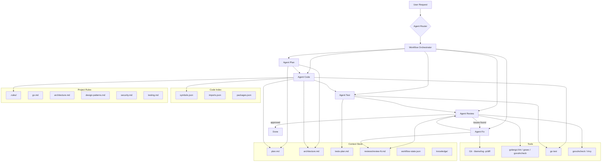

# AI Agents for Claude Code - Implementation Plan (v3)

**Target:** Go Backend Applications

---

## Tong quan

Xay dung 5 AI Agent chuyen biet hoat dong trong Claude Code, dieu phoi boi Workflow Orchestrator, phuc vu vong doi phat trien Go backend.

---

## Kien truc tong the



---

## Agent Router - 2-Layer Intent Detection

### Layer 1: LLM Intent Classifier

```
Input: user request
Output:
  intent = PLAN | CODE | TEST | FIX | REVIEW | FULL
  confidence = 0.0 - 1.0

Rules:
  confidence >= 0.8 --> route truc tiep
  confidence < 0.8  --> hoi lai user
```

### Layer 2: Rule Override

```
Force rules (override classifier):
  "plan" | "design" | "architecture" | "thiet ke"  --> PLAN
  "implement" | "code" | "build" | "tao"            --> CODE
  "test" | "coverage"                                --> TEST
  "bug" | "error" | "fix" | "loi" | "exception"     --> FIX
  "review" | "check" | "audit"                       --> REVIEW
  "/full"                                            --> FULL (toan bo pipeline)
```

---

## Workflow Orchestrator

### State Machine

```
PLANNING --> CODING --> TESTING --> REVIEWING --> DONE
                                      |
                                      v (issues found)
                                    FIXING --> REVIEWING
                                                 |
                                                 v (max 3 loops)
                                               ESCALATE (bao user)
```

### State Persistence: `workflow-state.json`

```json
{
  "workflow_id": "auth-feature-001",
  "state": "TESTING",
  "loop_count": 1,
  "max_loops": 3,
  "created_at": "2026-03-06T10:00:00Z",
  "updated_at": "2026-03-06T10:30:00Z",
  "artifacts": {
    "plan": ".ai-agents/plan.md",
    "architecture": ".ai-agents/architecture.md",
    "tests_plan": ".ai-agents/tests-plan.md",
    "reviews": [
      ".ai-agents/reviews/review-1.md"
    ]
  }
}
```

### Artifact Versioning

```
.ai-agents/
  |-- plan.md
  |-- architecture.md
  |-- tests-plan.md
  |-- workflow-state.json
  |-- reviews/
  |     |-- review-1.md
  |     |-- review-2.md
  |     +-- review-3.md
  |-- knowledge/
  |     |-- bugs-history.md
  |     +-- architecture-decisions.md
  +-- index/
        |-- symbols.json
        |-- imports.json
        +-- packages.json
```

### Agent Drift Prevention

Agent Code **bat buoc validate** `architecture.md` truoc khi sinh code:

```
1. Doc architecture.md
2. Xac dinh allowed dependencies giua layers
3. Sinh code
4. Verify: code KHONG vi pham dependency rules
5. Neu vi pham --> tu sua truoc khi chuyen sang Test
```

---

## Context Store

### Code Index (cho LLM context optimization)

```
.ai-agents/index/
  |-- symbols.json    # functions, types, interfaces
  |-- imports.json    # import graph
  +-- packages.json   # package structure
```

Tuong tu Sourcegraph / tree-sitter index. Giup agent chi gui **relevant code** vao context window thay vi toan bo codebase.

**QUAN TRONG:** Agent KHONG tu tay sua file index JSON (de hallucinate).
Cap nhat index bang tool/script:
```bash
# Makefile target hoac script su dung go/packages + tree-sitter
make update-index
# Hoac:
go run tools/indexer/main.go -out .ai-agents/index/
```
Agent chi goi lenh `make update-index` sau moi lan code thay doi.
Script su dung `golang.org/x/tools/go/packages` de parse AST chinh xac.

### Cost Control Strategy

```
Priority 1: Changed files
Priority 2: Direct imports (tu imports.json)
Priority 3: Interface definitions (tu symbols.json)
Priority 4: Related test files
KHONG gui: unrelated packages, vendor/, generated code

Advanced: AST dependency graph de xac dinh chinh xac scope
```

### Knowledge Memory

```
.ai-agents/knowledge/
  |-- bugs-history.md           # Loi da gap va cach fix
  +-- architecture-decisions.md  # ADR (Architecture Decision Records)
```

Agent hoc tu kinh nghiem truoc:
- Fix bug --> ghi vao bugs-history.md
- Thiet ke moi --> ghi vao architecture-decisions.md

---

## Project Rules Engine

```
.rules/
  |-- go.md              # Go-specific conventions
  |-- architecture.md    # Layer rules, dependency direction
  |-- design-patterns.md # Design patterns guidelines
  |-- security.md        # Secure coding rules
  +-- testing.md         # Testing standards
```

### `.rules/go.md` - Go Backend Rules

```
# Go Project Layout
cmd/           -- Entry points
internal/      -- Private application code
  domain/      -- Entities, value objects, business rules
  service/     -- Use cases, application logic
  repository/  -- Data access interfaces & implementations
  handler/     -- HTTP/gRPC handlers
pkg/           -- Public shared libraries
api/           -- Proto files, OpenAPI specs
configs/       -- Configuration files

# Dependency Direction (STRICT)
  domain --> (nothing)
  service --> domain
  repository --> domain
  handler --> service
  FORBIDDEN: handler --> domain (direct)
  FORBIDDEN: domain --> repository
  FORBIDDEN: domain --> infra

# Error Handling
  REQUIRED: fmt.Errorf("%w", err) for wrapping
  REQUIRED: errors.Is() / errors.As() for checking
  FORBIDDEN: return errors.New(...) without context
  FORBIDDEN: silent error swallowing (_, err := ...; ignore err)

# Context Usage
  REQUIRED: func(ctx context.Context, ...) for all service/repository methods
  FORBIDDEN: service method without context.Context as first param

# Naming
  REQUIRED: CamelCase for exported, camelCase for unexported
  REQUIRED: interface names without "I" prefix (Reader not IReader)
  REQUIRED: error variables: ErrNotFound, ErrInvalid...

# Interfaces (Go Idiom: "Accept interfaces, return structs")
  REQUIRED: Interface dinh nghia tai CONSUMER (service/ dinh nghia repo interface)
  REQUIRED: Producer (repository/) tra ve concrete struct
  REQUIRED: Interface nho (1-3 methods), tach nho neu > 5 methods
  FORBIDDEN: Interface dinh nghia o domain/ roi import nguoc (Java-style)
  FORBIDDEN: Interface voi chi 1 implementation va khong can mock

# Concurrency
  REQUIRED: goroutine must have cancellation mechanism
  REQUIRED: channel must be closed by sender
  FORBIDDEN: goroutine without context or done channel
```

### `.rules/design-patterns.md` - Go Design Patterns

```
# =============================================================
# DESIGN PATTERNS CHO GO BACKEND
# Agent PHAI doc file nay truoc khi thiet ke va sinh code.
# Chon pattern phu hop voi van de, KHONG ep pattern khi khong can.
# =============================================================

# -----------------------------------------------
# CREATIONAL PATTERNS
# -----------------------------------------------

## Factory Method
  KHI NAO: Tao objects co nhieu variant (payment processor, notifier, storage)
  GO IDIOM: Constructor function NewXxx() returning interface
  VI DU:
    func NewStorage(storageType string) Storage {
        switch storageType {
        case "s3":  return &S3Storage{}
        case "gcs": return &GCSStorage{}
        }
    }
  LUU Y: Uu tien Functional Options hon Factory phuc tap

## Builder
  KHI NAO: Object co nhieu optional config (query builder, request builder)
  GO IDIOM: Functional Options pattern (KHUYẾN KHÍCH cho Go)
  VI DU:
    type Option func(*Server)
    func WithPort(p int) Option { return func(s *Server) { s.port = p } }
    func WithTimeout(t time.Duration) Option { return func(s *Server) { s.timeout = t } }
    func NewServer(opts ...Option) *Server { ... }
  LUU Y: Functional Options la Go-idiomatic Builder

## Singleton
  KHI NAO: DB connection pool, logger, config (CHI dung khi that su can)
  GO IDIOM: sync.Once
  VI DU:
    var (
        instance *DB
        once     sync.Once
    )
    func GetDB() *DB {
        once.Do(func() { instance = &DB{...} })
        return instance
    }
  CANH BAO: Tranh lam dung. Uu tien Dependency Injection.

# -----------------------------------------------
# STRUCTURAL PATTERNS
# -----------------------------------------------

## Repository Pattern (BAT BUOC cho data access)
  KHI NAO: Moi entity can data access
  GO IDIOM: "Accept interfaces, return structs" (Consumer-side interfaces)
  VI DU:
    // service/user_service.go (CONSUMER dinh nghia interface)
    type UserRepository interface {
        FindByID(ctx context.Context, id string) (*domain.User, error)
        Save(ctx context.Context, user *domain.User) error
    }
    type UserService struct { repo UserRepository }

    // repository/user_postgres.go (PRODUCER tra ve struct)
    type PostgresUserRepo struct { db *sql.DB }
    func NewPostgresUserRepo(db *sql.DB) *PostgresUserRepo { ... }
    func (r *PostgresUserRepo) FindByID(ctx context.Context, id string) (*domain.User, error) { ... }
  BAT BUOC: Interface dinh nghia tai CONSUMER (service/), KHONG o domain/
  LUU Y: Giu interface nho (1-3 methods). Neu interface > 5 methods --> tach nho

## Adapter
  KHI NAO: Wrap external service/library (payment gateway, email provider)
  GO IDIOM: Interface + wrapper struct
  VI DU:
    type EmailSender interface { Send(ctx context.Context, to, body string) error }
    type sendgridAdapter struct { client *sendgrid.Client }
    func (a *sendgridAdapter) Send(ctx context.Context, to, body string) error { ... }
  MAC DINH SU DUNG, TRU KHI:
    - Library da co interface tot (vd: AWS SDK v2 da co interface san)
    - Chi co 1 implementation va khong can mock trong test
    - Wrapper chi forward method 1:1 khong them logic gi

## Decorator / Middleware
  KHI NAO: Them behavior khong sua code goc (logging, auth, metrics, rate limit)
  GO IDIOM: HTTP middleware chain, function wrapping
  VI DU:
    func LoggingMiddleware(next http.Handler) http.Handler {
        return http.HandlerFunc(func(w http.ResponseWriter, r *http.Request) {
            log.Printf("%s %s", r.Method, r.URL.Path)
            next.ServeHTTP(w, r)
        })
    }
    // Wrapping service:
    func WithLogging(svc UserService, logger Logger) UserService {
        return &loggingUserService{next: svc, logger: logger}
    }

## Facade
  KHI NAO: Gom nhieu service vao 1 entry point (order flow = inventory + payment + shipping)
  GO IDIOM: Struct aggregate cac dependencies
  VI DU:
    type OrderFacade struct {
        inventory InventoryService
        payment   PaymentService
        shipping  ShippingService
    }
    func (f *OrderFacade) PlaceOrder(ctx context.Context, order Order) error { ... }

# -----------------------------------------------
# BEHAVIORAL PATTERNS
# -----------------------------------------------

## Strategy
  KHI NAO: Thay doi algorithm luc runtime (pricing, sorting, compression)
  GO IDIOM: Interface + dependency injection
  VI DU:
    type PricingStrategy interface {
        Calculate(ctx context.Context, order Order) (Money, error)
    }
    type standardPricing struct{}
    type premiumPricing struct{}
    // Inject strategy vao service
    type OrderService struct { pricing PricingStrategy }

## Observer / Event-Driven (KHUYẾN KHÍCH cho decoupling)
  KHI NAO: Mot action trigger nhieu side effects (user created -> send email + create audit log)
  GO IDIOM: Channel-based hoac Event Bus
  VI DU:
    type Event struct { Type string; Payload interface{} }
    type EventBus struct {
        subscribers map[string][]func(Event)
        mu          sync.RWMutex
    }
    func (eb *EventBus) Publish(e Event) { ... }
    func (eb *EventBus) Subscribe(eventType string, handler func(Event)) { ... }
  LUU Y: Voi microservices, dung message broker (NATS, Kafka, RabbitMQ)

## Chain of Responsibility
  KHI NAO: Request qua nhieu buoc xu ly (validation chain, approval workflow)
  GO IDIOM: Middleware pattern hoac linked handlers
  VI DU: HTTP middleware chain (da mo ta o Decorator)

## Circuit Breaker (BAT BUOC cho external calls)
  KHI NAO: Goi external service (API, DB, message queue)
  GO IDIOM: Library gobreaker hoac tu implement
  VI DU:
    cb := gobreaker.NewCircuitBreaker(gobreaker.Settings{
        Name:        "payment-api",
        MaxRequests: 3,
        Timeout:     10 * time.Second,
    })
    result, err := cb.Execute(func() (interface{}, error) {
        return paymentClient.Charge(ctx, amount)
    })
  BAT BUOC: Moi external HTTP/gRPC call PHAI co circuit breaker

# -----------------------------------------------
# CONCURRENCY PATTERNS (GO-SPECIFIC)
# -----------------------------------------------

## Worker Pool
  KHI NAO: Xu ly nhieu task dong thoi co gioi han (batch processing, file upload)
  GO IDIOM: Buffered channel + goroutines
  VI DU:
    jobs := make(chan Job, 100)
    for i := 0; i < numWorkers; i++ {
        go func() {
            for job := range jobs {
                process(job)
            }
        }()
    }
  BAT BUOC: Phai co done channel hoac context de cancel

## Fan-Out / Fan-In
  KHI NAO: Chia task ra nhieu goroutine roi gom ket qua (parallel API calls)
  GO IDIOM: errgroup.Group
  VI DU:
    g, ctx := errgroup.WithContext(ctx)
    for _, url := range urls {
        url := url
        g.Go(func() error { return fetch(ctx, url) })
    }
    if err := g.Wait(); err != nil { ... }

## Pipeline
  KHI NAO: Data di qua nhieu buoc xu ly (ETL, data transformation)
  GO IDIOM: Channel chaining
  VI DU:
    func generate(ctx context.Context) <-chan int { ... }
    func transform(ctx context.Context, in <-chan int) <-chan string { ... }
    func sink(ctx context.Context, in <-chan string) { ... }

# -----------------------------------------------
# DEPENDENCY INJECTION (BAT BUOC)
# -----------------------------------------------

## Constructor Injection
  GO IDIOM: NewXxx(deps...) pattern
  VI DU:
    func NewUserService(repo UserRepository, logger Logger) *UserService {
        return &UserService{repo: repo, logger: logger}
    }
  BAT BUOC: Moi dependency inject qua constructor, KHONG dung global
  TUY CHON: wire (Google) hoac fx (Uber) cho DI container

# -----------------------------------------------
# PATTERN SELECTION GUIDE
# -----------------------------------------------

# Tinh huong                          --> Pattern
# Tao object co nhieu variant         --> Factory Method
# Config phuc tap voi nhieu option    --> Functional Options (Builder)
# Data access cho entity              --> Repository (BAT BUOC)
# Wrap external service               --> Adapter (MAC DINH, tru khi over-engineering)
# Them logging/metrics/auth           --> Decorator / Middleware
# Goi external API/service            --> Circuit Breaker (BAT BUOC)
# Thay doi algorithm luc runtime      --> Strategy
# Action trigger nhieu side effects   --> Observer / Event Bus
# Xu ly batch/parallel co limit       --> Worker Pool
# Parallel calls gom ket qua          --> Fan-Out / Fan-In (errgroup)
# Inject dependencies                 --> Constructor Injection (BAT BUOC)

# -----------------------------------------------
# ANTI-PATTERNS (KHONG DUOC LAM)
# -----------------------------------------------

# KHONG: God struct (struct lam qua nhieu viec)
# KHONG: Circular dependencies giua packages
# KHONG: Global mutable state (dung DI thay the)
# KHONG: Interface pollution (chi tao interface khi co >= 2 implementations hoac can mock)
# KHONG: Premature abstraction (khong tao pattern khi chi co 1 use case)
# KHONG: Deep inheritance (Go khong co inheritance, dung composition)
```

---

## 1. Agent Create Plan

**Muc tieu:** Phan tich yeu cau, thiet ke kien truc Go backend va tao ke hoach trien khai chi tiet.

### Input
- Mo ta yeu cau tu nguoi dung
- Codebase hien tai (neu co)
- `.rules/*`

### Output
- `plan.md` -- Ke hoach trien khai
- `architecture.md` -- So do kien truc (Mermaid)
- `tests-plan.md` -- Test cases voi coverage target

### Quy trinh hoat dong

```
1. Thu thap & phan tich yeu cau
   |-- Dat cau hoi lam ro neu yeu cau mo ho
   |-- Xac dinh scope, constraints, dependencies
   +-- Liet ke acceptance criteria

2. Thiet ke kien truc Go
   |-- Ve so do he thong (Mermaid: flowchart, sequence, class diagram)
   |-- Generate Go project layout:
   |     cmd/api/
   |     internal/domain/
   |     internal/service/
   |     internal/repository/
   |     internal/handler/
   |     pkg/
   |-- Dinh nghia interfaces giua layers
   |-- Dinh nghia data flow & API contracts (protobuf/OpenAPI)
   +-- Chon design patterns phu hop (doc .rules/design-patterns.md):
         - Xac dinh pattern nao can dung cho tung module
         - Ghi ro ly do chon pattern (khong ep khi khong can)
         - Dinh nghia interfaces cho Repository, Adapter, Strategy...
         - Xac dinh middleware chain (auth, logging, metrics, rate limit)
         - Xac dinh Circuit Breaker cho external calls

3. Lap ke hoach trien khai
   |-- Chia nho thanh cac task co thu tu uu tien
   |-- Xac dinh file can tao/sua (theo Go layout)
   |-- Dinh nghia interface giua cac module
   +-- Uoc luong do phuc tap tung task

4. Thiet ke test plan
   |-- Liet ke test cases cho tung module
   |-- Xac dinh edge cases & error scenarios
   |-- Dinh nghia test data & mocks can thiet
   +-- Dat coverage target (minimum 80%)
```

### Cau truc file `plan.md`

```markdown
# Feature: [Ten]
## Yeu cau
## Kien truc (Mermaid diagrams)
## Go Project Layout (file tree)
## Danh sach task (co thu tu)
## File can tao/sua
## Interface & API contracts (protobuf/OpenAPI)
## Design Patterns (pattern nao, tai sao, o module nao)
## Test plan (voi coverage target)
## Security considerations
## Risks & mitigations
```

---

## 2. Agent Create Code

**Muc tieu:** Sinh Go code chat luong cao, tuan thu SOLID, Clean Architecture, va Go best practices.

### Input
- `plan.md` + `architecture.md` tu Agent Plan (neu co)
- `.rules/*` (bat buoc)
- `.ai-agents/index/` (code index)
- Codebase hien tai

### Output
- Go source code tuan thu SOLID & Clean Architecture
- Cap nhat plan.md voi trang thai hoan thanh

### Architecture Validation (chong agent drift)

```
TRUOC KHI SINH CODE:
  1. Doc architecture.md
  2. Load .rules/go.md
  3. Xac dinh dependency direction cho tung file
  4. Sinh code
  5. Verify: khong vi pham layer rules
  6. Neu vi pham --> tu sua
```

### Go Code Principles

```
SOLID Principles
|-- S -- Single Responsibility: Moi struct/function mot nhiem vu
|-- O -- Open/Closed: Mo rong qua interfaces
|-- L -- Liskov Substitution: Interface satisfaction
|-- I -- Interface Segregation: Interface nho (io.Reader, io.Writer)
+-- D -- Dependency Inversion: Depend on interfaces, not structs

Clean Architecture Layers (Go)
|-- domain/      -- Entities, value objects, business rules (no imports from other layers)
|-- service/     -- Use cases, orchestration (imports domain only)
|-- repository/  -- Data access (imports domain for types)
|-- handler/     -- HTTP/gRPC handlers (imports service)
+-- infra/       -- DB connections, external clients, configs
```

### Design Patterns Compliance (doc .rules/design-patterns.md)

```
MAC DINH ap dung (bo qua neu over-engineering):
  - [ ] Repository Pattern cho moi entity data access (interface tai consumer)
  - [ ] Adapter Pattern cho external service (TRU KHI library da co interface tot)
  - [ ] Circuit Breaker cho external HTTP/gRPC call
  - [ ] Constructor Injection cho moi dependency (KHONG dung global)
  - [ ] Middleware/Decorator cho cross-cutting concerns (auth, logging, metrics)
  NGUYEN TAC: Go uu tien don gian. Neu pattern chi them 1 lop boc ma khong them gia tri --> bo qua

AP DUNG KHI PHU HOP (theo plan.md):
  - [ ] Functional Options khi struct co nhieu optional config
  - [ ] Factory Method khi can tao objects co nhieu variant
  - [ ] Strategy khi algorithm thay doi luc runtime
  - [ ] Observer/Event Bus khi action trigger nhieu side effects
  - [ ] Worker Pool / Fan-Out khi can xu ly parallel co limit
  - [ ] Facade khi gom nhieu service vao 1 flow

KIEM TRA ANTI-PATTERNS:
  - [ ] Khong co God struct
  - [ ] Khong co circular dependencies
  - [ ] Khong co global mutable state
  - [ ] Khong co interface pollution (interface chi khi >= 2 impl hoac can mock)
  - [ ] Khong co premature abstraction
```

### Secure Coding Validation (bat buoc)

```
Go-specific security checklist:
  - [ ] Input validation tai moi handler
  - [ ] Parameterized queries (KHONG string concat SQL, ke ca voi GORM raw)
  - [ ] Secure JWT: algorithm validation, expiry check, key rotation
  - [ ] KHONG hardcode secrets (dung env / vault)
  - [ ] Dung crypto/rand thay math/rand cho security
  - [ ] json.Decoder co limit (chong JSON injection / DoS)
  - [ ] Context timeout cho moi external call
  - [ ] Goroutine co cancellation mechanism (chong goroutine leak)
  - [ ] CORS configuration dung
  - [ ] TLS cho moi external connection
```

### Quy trinh hoat dong

```
1. Doc .rules/* va plan.md
   |-- Parse danh sach task
   |-- Hieu kien truc da thiet ke
   |-- Validate dependency direction
   +-- Nam interface contracts

2. Phan tich codebase (dung Code Index)
   |-- Doc symbols.json, imports.json
   |-- Xac dinh conventions dang dung
   |-- Tim patterns & interfaces co san
   +-- Kiem tra go.mod dependencies

3. Sinh code theo tung task
   |-- Tao file theo Go project layout
   |-- Ap dung SOLID principles
   |-- Tuan thu layer separation (.rules/go.md)
   |-- Ap dung design patterns theo plan.md (.rules/design-patterns.md):
   |     - Repository interface tai consumer (service/), impl o repository/
   |     - Adapter cho external services (tru khi library da co interface tot)
   |     - Circuit Breaker cho external calls
   |     - Middleware chain cho HTTP handlers
   |     - Functional Options cho config structs
   |-- Ap dung secure coding rules
   |-- Moi service method co context.Context
   |-- Error wrapping voi fmt.Errorf("%w")
   +-- Dam bao backward compatibility

4. Kiem tra chat luong
   |-- go build ./...
   |-- go vet ./...
   |-- Doi chieu voi architecture.md (chong drift)
   +-- Chay secure coding checklist
```

### Checklist truoc khi hoan thanh

- [ ] Code tuan thu SOLID
- [ ] Design patterns dung theo plan (Repository, Adapter, Circuit Breaker...)
- [ ] Khong co anti-patterns (God struct, circular deps, global state, interface pollution)
- [ ] Tach layer dung (.rules/go.md)
- [ ] Dependency direction dung (domain khong import infra)
- [ ] Moi service method co context.Context
- [ ] Error handling: fmt.Errorf("%w"), errors.Is/As
- [ ] Goroutine co cancellation
- [ ] Khong break backward compatibility
- [ ] Naming conventions Go (CamelCase, no I-prefix)
- [ ] Secure coding checklist pass
- [ ] go build / go vet pass

---

## 3. Agent Test Generator

**Muc tieu:** Sinh Go test suite day du voi table-driven tests va coverage target.

### Input
- Source code tu Agent Code
- `tests-plan.md`
- `.rules/testing.md`

### Output
- Unit tests (table-driven)
- Integration tests (testcontainers neu can)
- Coverage report

### Go Testing Standards

```
1. Table-driven tests (bat buoc)
   tests := []struct {
       name    string
       input   InputType
       want    OutputType
       wantErr bool
   }{...}
   for _, tt := range tests {
       t.Run(tt.name, func(t *testing.T) { ... })
   }

   BAT BUOC: Moi test case PHAI co assert/require (testify):
     - assert gia tri tra ve (KHONG chi goi ham roi bo qua result)
     - assert error (wantErr true --> require.Error, false --> require.NoError)
     - assert state thay doi (neu co side effect)
     FORBIDDEN: Test chi goi function ma khong assert gi (coverage trap)

2. Mocking
   |-- gomock cho interfaces
   |-- testify/mock khi can flexibility
   +-- Moi dependency inject qua interface

3. Integration tests
   |-- Build tag: //go:build integration
   |-- testcontainers-go cho DB/Redis/Kafka
   +-- Tach rieng khoi unit tests

4. Test file placement
   |-- Unit: internal/service/user_service_test.go
   +-- Integration: tests/integration/user_test.go
```

### Coverage Policy

```
Minimum coverage: 80% (toan project)
  |-- domain/:     90%
  |-- service/:    85%
  |-- handler/:    80%
  |-- repository/: 70% (external dependencies)
  +-- Critical paths (auth, payment): 95%
```

### Quy trinh hoat dong

```
1. Doc tests-plan.md va source code
   |-- Hieu cac module can test
   +-- Xac dinh interfaces can mock

2. Sinh tests
   |-- Table-driven tests cho tung function
   |-- Generate mocks (gomock/testify)
   |-- Edge cases: nil, empty, boundary, overflow, context cancel
   +-- Error scenario tests

3. Chay va verify
   |-- go test ./... -cover
   |-- Kiem tra coverage >= target
   |-- go test -race (detect race conditions)
   |-- Neu coverage chua dat --> sinh them test
   +-- Report ket qua

4. Integration tests (neu can)
   |-- Setup testcontainers
   |-- Test voi real DB/Redis
   +-- go test -tags=integration ./tests/...
```

---

## 4. Agent Fix Bug

**Muc tieu:** Phan tich, xac dinh nguyen nhan va sua bug Go backend.

### Input
- Mo ta loi (error message, stack trace, steps to reproduce)
- Codebase hien tai

### Output
- Code fix
- Regression test (table-driven)
- Root cause report
- Cap nhat knowledge/bugs-history.md

### Quy trinh hoat dong

```
1. Phan tich loi
   |-- Parse error message / stack trace
   |-- Xac dinh file & line lien quan
   |-- Thu thap context xung quanh loi
   |-- git blame -- xem ai/khi nao sua
   |-- git log -p -n 10 -- recent changes cua file lien quan
   +-- git diff -- so sanh voi version truoc khi bug xuat hien

2. Xac dinh root cause
   |-- Trace code flow tu diem loi
   |-- Kiem tra input/output tai tung buoc
   |-- Go-specific checks:
   |     - goroutine leak?
   |     - nil pointer (interface nil vs typed nil)?
   |     - context cancelled/timeout?
   |     - race condition?
   |     - error swallowed?
   +-- Phan biet symptom vs root cause

3. Danh gia impact
   |-- Liet ke cac module/function bi anh huong
   |-- Kiem tra co bug tuong tu o noi khac
   +-- Xac dinh pham vi thay doi toi thieu

4. Thuc hien fix
   |-- Sua code voi thay doi nho nhat co the
   |-- Viet regression test (table-driven)
   |-- go test ./... -race
   |-- go vet ./...
   +-- Verify fix khong break tinh nang cu

5. Bao cao & luu knowledge
   |-- Root cause analysis
   |-- Giai phap da ap dung
   |-- Commit/PR lien quan
   |-- De xuat phong tranh loi tuong tu
   +-- Ghi vao .ai-agents/knowledge/bugs-history.md
```

### Nguyen tac fix bug

```
1. Minimal change     -- Chi sua dung cho can sua
2. Test first         -- Viet test reproduce bug truoc khi fix
3. No side effects    -- go test ./... phai pass
4. Root cause focus   -- Fix nguyen nhan goc
5. Git-aware          -- git blame/log -p/diff de hieu context
6. Race-aware         -- go test -race sau khi fix
7. Document           -- Ghi vao bugs-history.md
```

### Rollback Strategy

```
Orchestrator tao temp branch TRUOC KHI Agent Code bat dau:
  git checkout -b agent-wip-<feature-name>

Neu fix gay loi moi:
  1. git stash (neu chua commit)
  2. git revert (neu da commit)
  3. Bao cao cho user voi context day du
  4. KHONG tu dong retry qua 2 lan

Neu loop count > max_loops (3):
  1. git reset --hard ve commit truoc khi Agent Code bat dau
  2. Giu nguyen branch agent-wip-* de user co the review
  3. Bao cao toan bo findings va de xuat user tu xu ly
  KHONG bao gio: merge code bi loi vao main branch
```

---

## 5. Agent Review Code

**Muc tieu:** Review Go code toan dien: chat luong, security (OWASP Top 10), performance.

### Input
- Code can review (diff hoac toan bo file)
- Context ve tinh nang
- `.rules/*`

### Output
- Review report voi severity levels
- Security findings (OWASP + Go-specific)
- Static analysis results
- Luu vao `.ai-agents/reviews/review-N.md`

### Review Pipeline (3 layers)

```
Layer 1: Static Analysis (automated)
  |-- golangci-lint run (code quality, >100 linters)
  |-- gosec ./... (security patterns)
  +-- govulncheck ./... (dependency vulnerabilities)

Layer 2: AI Review (intelligent)
  |-- SOLID compliance
  |-- Design Patterns compliance (.rules/design-patterns.md)
  |     - Repository cho data access?
  |     - Adapter cho external services?
  |     - Circuit Breaker cho external calls?
  |     - Anti-patterns detected?
  |-- Clean Architecture / layer violations
  |-- .rules/* compliance
  |-- Business logic correctness
  +-- Performance analysis

Layer 3: Security Review (OWASP + Go-specific)
  |-- OWASP Top 10 checklist
  |-- Go-specific security issues
  +-- Dependency vulnerability scan
```

### OWASP Top 10 (2025) Checklist

```
A01: Broken Access Control
  +-- Authorization, RBAC, CORS, directory traversal

A02: Cryptographic Failures
  +-- Encryption, hashing, key management, TLS

A03: Injection
  +-- SQL injection (GORM raw queries!), XSS, command injection
  +-- Go-specific: json.Unmarshal without validation

A04: Insecure Design
  +-- Threat modeling, secure design patterns, trust boundaries

A05: Security Misconfiguration
  +-- Default configs, debug mode in prod, error messages lo info

A06: Vulnerable & Outdated Components
  +-- govulncheck, go.mod audit

A07: Identification & Authentication Failures
  +-- JWT validation, session management, bcrypt cost

A08: Software & Data Integrity Failures
  +-- Insecure deserialization, CI/CD integrity

A09: Security Logging & Monitoring Failures
  +-- Thieu audit log, log sensitive data

A10: Server-Side Request Forgery (SSRF)
  +-- Unvalidated URLs, internal network access
```

### Design Patterns Review

```
Kiem tra (MAC DINH ap dung, bo qua neu over-engineering):
  - Repository Pattern cho moi entity data access (interface tai consumer)?
  - Adapter Pattern cho external service (tru khi library da co interface tot)?
  - Circuit Breaker cho external call?
  - Constructor Injection (khong dung global state)?
  - Middleware cho cross-cutting concerns?

Anti-patterns check:
  - God struct (struct > 7 fields hoac > 5 methods)?
  - Circular dependencies giua packages?
  - Global mutable state?
  - Interface pollution (interface voi 1 impl va khong can mock)?
  - Premature abstraction (pattern cho 1 use case)?

Pattern misuse check:
  - Singleton khi nen dung DI?
  - Factory khi chi co 1 variant?
  - Strategy khi chi co 1 algorithm?
```

### Go-Specific Security Issues

```
1. JSON injection     -- json.Unmarshal without struct validation
2. Goroutine leaks    -- goroutine without done/cancel
3. Context timeout    -- external call without timeout
4. SQL injection      -- GORM .Raw() / .Exec() voi string concat
5. Race conditions    -- shared state without mutex/channel
6. Nil interface      -- typed nil vs interface nil confusion
```

### Severity Levels

| Level | Y nghia | Hanh dong |
|-------|---------|-----------|
| CRITICAL | Security vulnerability, data loss risk | Phai fix ngay |
| HIGH | Bug tiem an, vi pham architecture nghiem trong | Fix truoc khi merge |
| MEDIUM | Code smell, performance concern | Nen fix |
| LOW | Style, convention, minor improvement | Tuy chon |
| INFO | Suggestion, best practice | Tham khao |

### Format review output

```markdown
## Review: [File/Feature]
### Summary: [Pass / Pass with comments / Needs changes / Reject]

### Static Analysis (golangci-lint / gosec / govulncheck)
- Findings: ...

### AI Review Findings
#### [CRITICAL] Ten finding
- File: internal/service/user.go:42
- Van de: Mo ta
- OWASP: A03 (neu lien quan)
- De xuat: Code fix cu the

### Design Patterns
- Compliance: [OK / Issues found]
- Anti-patterns: ...
- Missing patterns: ...

### Go-Specific Issues
- Goroutine leaks: ...
- Race conditions: ...

### Dependency Security (govulncheck)
- Vulnerabilities: ...
- CVEs: ...

### Statistics
- Files reviewed: X
- Findings: X critical, X high, X medium, X low
- Test coverage: X%
```

---

## CI/CD Integration

### Pipeline Flow

```
Agent sinh code
  |
  v
git commit (atomic, descriptive message)
  |
  v
CI Pipeline:
  |-- go build ./...
  |-- go test ./... -race -cover
  |-- golangci-lint run
  |-- gosec ./...
  |-- govulncheck ./...
  +-- coverage check >= 80%
  |
  v
Pass --> merge
Fail --> Agent Fix --> re-run CI
```

---

## Trien khai

### Phase 1 -- Foundation
- Tao `.rules/` (go.md, architecture.md, design-patterns.md, security.md, testing.md)
- Xay dung Context Store (`.ai-agents/`)
- Viet indexer script/tool (dung go/packages + tree-sitter) cho Code Index
- Setup static analysis (golangci-lint, gosec, govulncheck)
- Thiet ke prompt system cho tung agent

### Phase 2 -- Core Agents
- Implement Agent Router (2-layer intent detection)
- Implement Agent Create Plan (Go layout aware)
- Implement Agent Create Code (voi architecture validation + secure coding)
- Tich hop flow: Plan --> Code

### Phase 3 -- Quality Agents
- Implement Agent Test Generator (table-driven, gomock, testcontainers)
- Implement Agent Review Code (3-layer pipeline)
- Tich hop flow: Code --> Test --> Review

### Phase 4 -- Fix & Orchestration
- Implement Agent Fix Bug (git log -p, race detection)
- Implement Workflow Orchestrator (state machine, loop control, artifact versioning)
- Tich hop full flow: Plan --> Code --> Test --> Review --> Fix --> Review --> Done
- Knowledge Memory system

### Phase 5 -- CI/CD & Optimization
- CI/CD integration (go test, golangci-lint, gosec, govulncheck)
- AST dependency graph cho context optimization
- Fine-tune prompts dua tren feedback thuc te
- Toi uu token usage

---

## Cach su dung (du kien)

```bash
# Full workflow: Plan --> Code --> Test --> Review
/sc:agent-full "Them tinh nang authentication voi JWT"

# Tao plan cho feature moi
/sc:agent-plan "Them tinh nang user management CRUD"

# Sinh code tu plan
/sc:agent-code --plan .ai-agents/plan.md

# Sinh tests
/sc:agent-test --coverage 80

# Fix bug
/sc:agent-fix "Error: nil pointer dereference tai internal/service/user.go:42"

# Review code
/sc:agent-review --files "internal/service/**"

# Review chi security
/sc:agent-review --security-only --files "internal/handler/**"
```
